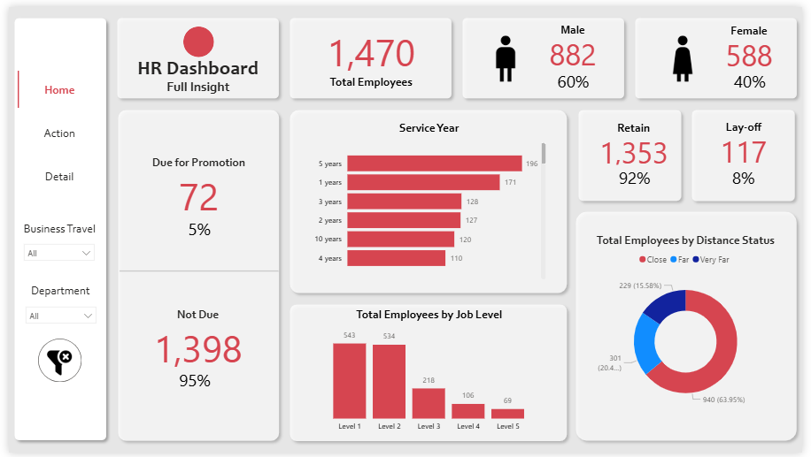
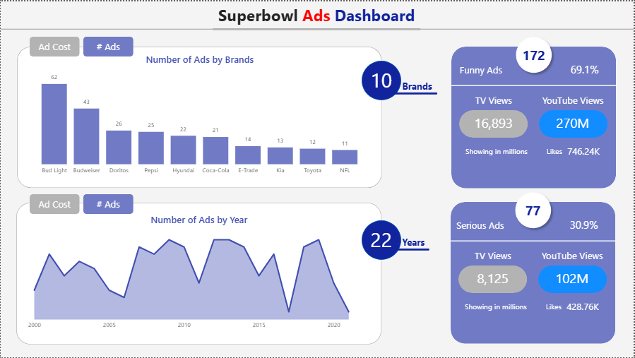

# Power BI Analytics Portfolio  

Welcome to my **Power BI Analytics Portfolio** 🚀.  
This repository showcases a collection of **6 end-to-end Power BI projects**, each demonstrating my skills in:  

- Data preparation & modeling  
- DAX calculations  
- Report design & visualization  
- Business insights storytelling  

Each project has its own folder containing:  
- **Report file** (`.pbix`)  
- **Dataset** (CSV/Excel/other formats)  

Preview images of the first pages of the reports are also available in the **`images/`** folder and included below.  

---

## 📊 Projects  

### 1. [Dashboard 1](/Dashboard\ 1)  
**Domain:** e.g. Retail / Sales / Healthcare / Finance  
**Highlights:**  
- Data cleaning and transformation in Power Query  
- Key KPIs with DAX measures  
- Interactive dashboards with filters and drill-downs  

**Preview:**  
  

---

### 2. [Dashboard 2](./Dashboard 2)  
**Domain:** e.g. Marketing / Customer Analytics  
**Highlights:**  
- Customer segmentation and churn analysis  
- RFM analysis with DAX  
- Storytelling through visuals  

**Preview:**  
  

---

### 3. [Project Title 3](./Project3)  
**Domain:** e.g. Operations / Logistics  
**Highlights:**  
- Data integration from multiple sources  
- Trend and variance analysis  
- Forecasting with Power BI visuals  

**Preview:**  
  

---

### 4. [Project Title 4](./Project4)  
**Domain:** e.g. Finance / Investment Analytics  
**Highlights:**  
- Profitability & ROI analysis  
- Financial statement dashboards  
- Custom visuals for insights  

**Preview:**  
  

---

### 5. [Project Title 5](./Project5)  
**Domain:** e.g. Healthcare / Public Data  
**Highlights:**  
- Patient / population analysis  
- KPI tracking for healthcare performance  
- Drill-through reports  

**Preview:**  
  

---

### 6. [Project Title 6](./Project6)  
**Domain:** e.g. HR / Workforce Analytics  
**Highlights:**  
- Employee attrition trends  
- Diversity and inclusion metrics  
- Interactive executive summary dashboard  

**Preview:**  
  

---

## 🔧 How to Use  
1. Clone this repository  
2. Open the `.pbix` file for any project in **Power BI Desktop**  
3. Explore the dataset and report design  

---

## 📬 Contact  
If you’d like to collaborate, discuss these projects, or explore analytics opportunities, feel free to reach out:  

- **Email:** [your email]  
- **LinkedIn:** [your LinkedIn profile]  

---

✨ Thanks for visiting my Power BI portfolio!  
